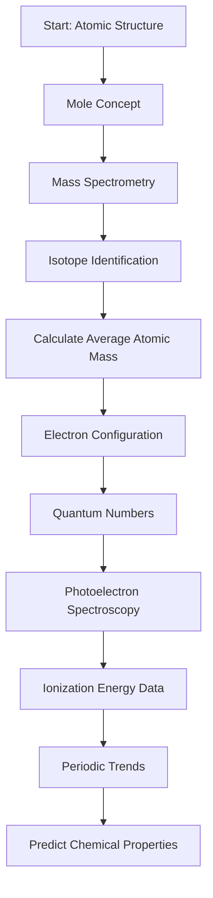

# Unit 1: Atomic Structure and Properties

## Overview
This unit explores the fundamental building blocks of matter, focusing on **atomic structure**, **electron configurations**, and how atoms interact with energy. Mastery of concepts like **moles**, **mass spectrometry**, and **periodic trends** is essential for understanding chemical behavior and predicting properties, which are frequently tested on the AP Chemistry exam.

## Key Concepts at a Glance

| **Concept**                | **What It Is**                                                                 | **Why It Matters (AP angle)**                                                                                 |
|---------------------------|--------------------------------------------------------------------------------|---------------------------------------------------------------------------------------------------------------|
| **Mole and Avogadro's Number** | The mole is a counting unit for atoms/molecules; \(6.022 \times 10^{23}\) entities per mole. | Fundamental for stoichiometry and converting between microscopic and macroscopic scales on the exam.           |
| **Mass Spectrometry**      | Technique to determine atomic/molecular masses and isotopic composition.       | Helps identify elements/isotopes and calculate average atomic mass, often tested in isotope-related questions. |
| **Electron Configuration**| Arrangement of electrons in atomic orbitals following Aufbau, Pauli, and Hund’s rules. | Predicts chemical properties and reactivity; essential for understanding periodic trends and bonding.         |
| **Photoelectron Spectroscopy (PES)** | Experimental method to measure ionization energies of electrons in atoms.           | Provides evidence for electron configurations and energy levels; supports conceptual questions on exam.       |
| **Periodic Trends**        | Patterns in atomic radius, ionization energy, electron affinity, and electronegativity across the periodic table. | Crucial for predicting element behavior and comparing elements, a common AP exam topic.                        |
| **Isotopes and Atomic Mass**| Atoms of the same element with different neutron numbers; average atomic mass is weighted by abundance. | Important for mass calculations and interpreting mass spectra questions.                                       |
| **Quantum Numbers**        | Set of four numbers (\(n, l, m_l, m_s\)) describing electron position and spin. | Basis for electron configuration and understanding atomic orbitals, often tested conceptually.                |

## Core Processes / Relationships

## Essential Formulas / Laws / Rules

- **Mole Definition:**
  $$
  1 \text{ mole} = 6.022 \times 10^{23} \text{ particles}
  $$

- **Average Atomic Mass:**
  $$
  \text{Average Atomic Mass} = \sum (\text{fractional abundance}_i \times \text{mass}_i)
  $$

- **Energy of a Photon (related to PES):**
  $$
  E = h \nu = \frac{hc}{\lambda}
  $$
  where \(h = 6.626 \times 10^{-34} \, \text{J·s}\), \(\nu\) is frequency, \(c\) is speed of light, and \(\lambda\) is wavelength.

- **Ionization Energy Trend:**
  Ionization energy generally **increases across a period** and **decreases down a group**.

- **Electron Configuration Rules:**
  - **Aufbau Principle:** Fill lowest energy orbitals first.
  - **Pauli Exclusion Principle:** Max two electrons per orbital with opposite spins.
  - **Hund’s Rule:** Fill degenerate orbitals singly first, then pair electrons.

## Connections & Comparisons

| **Concept**                  | **Mass Spectrometry**                          | **Photoelectron Spectroscopy (PES)**                   | **Electron Configuration**                        |
|------------------------------|-----------------------------------------------|--------------------------------------------------------|--------------------------------------------------|
| **Purpose**                  | Determine masses and isotopic composition     | Measure ionization energies of electrons               | Describe distribution of electrons in orbitals   |
| **Data Output**              | Mass-to-charge ratio (m/z) peaks              | Peaks corresponding to ionization energies             | Orbital filling order and electron count         |
| **AP Exam Focus**            | Calculating average atomic mass, isotope ratios | Explaining ionization energy trends and electron removal | Predicting chemical properties and periodic trends |
| **Relation to Atomic Structure** | Identifies isotopes and relative abundance   | Provides evidence for energy levels and electron shells | Shows arrangement of electrons influencing reactivity |

## Common AP Exam Traps

- Confusing **mass number** (protons + neutrons) with **atomic number** (protons only).
- Forgetting to apply **Hund’s Rule** when writing electron configurations, leading to incorrect orbital filling.
- Misinterpreting **mass spectrometry data** by mixing up isotope abundance and mass.
- Assuming ionization energy always increases without exceptions (e.g., between groups 2 and 13 or 15 and 16).
- Overlooking that **photoelectron spectroscopy** measures energy to remove electrons, not the energy of emitted photons.

## Quick Review Checklist

- [ ] Define the mole and use Avogadro’s number for conversions.
- [ ] Interpret mass spectrometry graphs and calculate average atomic mass.
- [ ] Write correct electron configurations using Aufbau, Pauli, and Hund’s rules.
- [ ] Explain the significance of quantum numbers.
- [ ] Analyze photoelectron spectroscopy data to determine ionization energies.
- [ ] Describe and predict periodic trends (atomic radius, ionization energy, electronegativity).
- [ ] Differentiate isotopes and calculate weighted average atomic masses.
- [ ] Identify common exceptions in periodic trends and electron configurations.

---

This structured guide will prepare you to confidently tackle questions on atomic structure and properties, a foundational topic that supports all future AP Chemistry units.