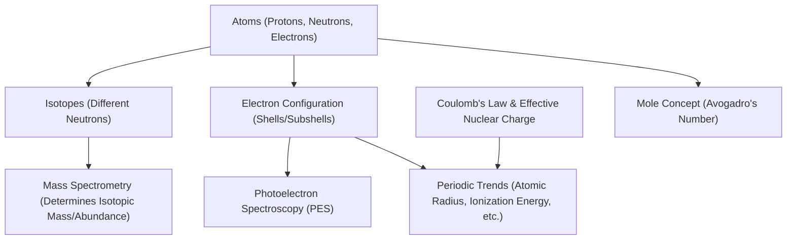

# Unit 1: Atomic Structure and Properties

## Overview

This unit introduces the fundamental building blocks of matter—atoms—and explores how their structure determines chemical properties and behaviors. You'll learn how chemists count atoms (the mole), analyze atomic structure (mass spectrometry, spectroscopy), and explain trends in the periodic table. Mastery here is crucial for success on the AP Chemistry exam, as these concepts underpin all later topics.

---

## Key Concepts at a Glance

| **Concept**                  | **What It Is**                                                                 | **Why It Matters (AP angle)**                                    |
|------------------------------|-------------------------------------------------------------------------------|------------------------------------------------------------------|
| **The Mole & Avogadro's Number** | Counting unit for atoms/molecules; \(6.022 \times 10^{23}\) entities per mole | Essential for stoichiometry and quantitative chemistry problems   |
| **Atomic Structure**         | Protons, neutrons, electrons; nucleus and electron cloud                     | Explains element identity, isotopes, and charge                   |
| **Mass Spectrometry**        | Technique to determine isotopic composition and atomic mass                   | Used in data-based AP questions about atomic mass and isotopes    |
| **Electron Configuration**   | Arrangement of electrons in shells/subshells/orbitals                        | Predicts reactivity, ion formation, and periodic trends           |
| **Photoelectron Spectroscopy (PES)** | Experimental method to determine electron energies in atoms                | AP data analysis and interpretation questions                     |
| **Periodic Trends**          | Patterns in atomic radius, ionization energy, etc., across the periodic table | Explains and predicts element properties and reactivity           |
| **Coulomb’s Law**            | Describes force between charged particles                                    | Justifies trends in ionization energy and atomic size             |
| **Effective Nuclear Charge (\(Z_{\text{eff}}\))** | Net positive charge experienced by valence electrons                    | Explains periodic trends and electron behavior                    |

---

## Core Processes / Relationships

---

## Essential Formulas / Laws / Rules

- **Avogadro’s Number**  
  $$ 1\,\text{mol} = 6.022 \times 10^{23}\,\text{particles} $$
- **Average Atomic Mass**  
  $$ \text{Average Atomic Mass} = \sum (\text{Fractional Abundance} \times \text{Isotope Mass}) $$
- **Coulomb’s Law**  
  $$ F = k \frac{q_1 q_2}{r^2} $$
  Where \( F \) = force, \( q_1, q_2 \) = charges, \( r \) = distance, \( k \) = constant
- **Photoelectric Effect (PES)**  
  $$ E_{\text{photon}} = h\nu = \text{Binding Energy} + \text{Kinetic Energy} $$
- **Electron Configuration Rules**  
  - **Aufbau Principle**: Electrons fill lowest energy orbitals first.
  - **Pauli Exclusion Principle**: No two electrons in an atom can have the same set of quantum numbers.
  - **Hund’s Rule**: Electrons fill degenerate orbitals singly before pairing.
- **Effective Nuclear Charge**  
  $$ Z_{\text{eff}} = Z - S $$
  Where \( Z \) = atomic number, \( S \) = shielding electrons

---

## Connections & Comparisons

| **Topic 1**              | **Topic 2**                  | **How They Relate / Differ**                                                                 |
|--------------------------|------------------------------|----------------------------------------------------------------------------------------------|
| **Isotopes**             | **Ions**                     | Isotopes: same element, different neutrons; Ions: same element, different electrons/charge   |
| **Mass Spectrometry**    | **Photoelectron Spectroscopy** | Mass spec measures mass/abundance; PES measures electron binding energies                    |
| **Atomic Radius Trend**  | **Ionization Energy Trend**  | Atomic radius decreases across a period; ionization energy increases (due to \(Z_{\text{eff}}\)) |
| **Electron Configuration** | **Periodic Trends**           | Electron configuration explains why trends (like reactivity, size) occur across the table    |

---

## Common AP Exam Traps

- Confusing **isotopes** (different neutrons) with **ions** (different electrons/charge).
- Forgetting that **average atomic mass** is weighted by percent abundance, not a simple average.
- Mixing up the order of **electron filling** (e.g., 4s fills before 3d).
- Assuming all periodic trends are absolute—exceptions exist, especially in transition metals.
- Misinterpreting **PES spectra**: peaks correspond to electrons in different subshells, not different elements.

---

## Quick Review Checklist

- [ ] Define and use the **mole** and **Avogadro’s number** in calculations.
- [ ] Distinguish between **protons, neutrons, electrons**, and explain **isotopes** and **ions**.
- [ ] Interpret **mass spectrometry data** to determine isotopic composition and average atomic mass.
- [ ] Write and interpret **electron configurations** (including ions).
- [ ] Analyze **photoelectron spectroscopy (PES) data** to deduce electron energies.
- [ ] Explain and predict **periodic trends** (atomic radius, ionization energy, etc.).
- [ ] Apply **Coulomb’s Law** and **effective nuclear charge** to justify trends.
- [ ] Recognize and avoid common misconceptions about atomic structure and periodicity.

---