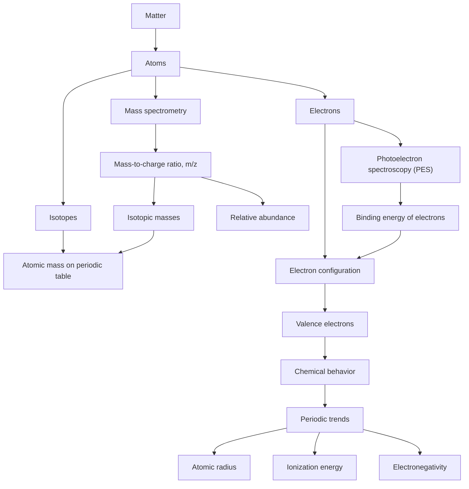

# Unit 1: Atomic Structure and Properties

## Overview
This unit builds the foundation for everything else in AP Chemistry: how matter is measured, how atoms are structured, and how electrons behave in atoms. You’ll use **moles**, **mass spectrometry**, **electron configuration**, **photoelectron spectroscopy (PES)**, and **periodic trends** to explain why elements have the properties they do and how those properties change across the periodic table. These ideas show up constantly on the AP exam because they connect numerical data, atomic theory, and real chemical behavior.

## Key Concepts at a Glance

| **Concept** | **What It Is** | **Why It Matters (AP angle)** |
|---|---|---|
| **Mole** | A counting unit equal to \(6.022 \times 10^{23}\) particles | Used in nearly every quantitative chemistry problem |
| **Molar mass** | Mass of \(1\) mole of a substance in g/mol | Connects mass in the lab to number of particles |
| **Mass spectrometry** | Technique that separates ions by mass-to-charge ratio \(\frac{m}{z}\) | Used to determine isotopic masses and relative abundance |
| **Isotopes** | Atoms of the same element with different numbers of neutrons | Explains non-integer atomic masses and mass spec patterns |
| **Electron configuration** | Arrangement of electrons in orbitals | Predicts chemical reactivity and periodic trends |
| **Photoelectron spectroscopy (PES)** | Measures energy required to remove electrons from atoms | Provides experimental evidence for subshell structure |
| **Periodic trends** | Predictable changes in atomic radius, ionization energy, and electronegativity | Common multiple-choice and free-response reasoning skill |
| **Effective nuclear charge** | Net positive charge felt by valence electrons | Explains why properties change across periods |

## Core Processes / Relationships

**Big idea:** atomic structure determines electron arrangement, and electron arrangement determines periodic properties and reactivity.

## Essential Formulas / Laws / Rules

$$\text{moles} = \frac{\text{mass}}{\text{molar mass}}$$

$$N = n \cdot N_A$$

where

$$N_A = 6.022 \times 10^{23}\ \text{particles/mol}$$

For isotopic atomic mass:

$$\text{average atomic mass} = \sum (\text{fractional abundance})(\text{isotopic mass})$$

Mass spectrometry uses:

$$\frac{m}{z}$$

where \(m\) is mass and \(z\) is charge.

### Electron configuration rules
- **Aufbau principle:** electrons fill lowest-energy orbitals first
- **Pauli exclusion principle:** each orbital holds at most \(2\) electrons with opposite spins
- **Hund’s rule:** electrons occupy degenerate orbitals singly before pairing

### Orbital capacities
- \(s\): \(2\) electrons
- \(p\): \(6\) electrons
- \(d\): \(10\) electrons
- \(f\): \(14\) electrons

### Periodic trends
- **Atomic radius:** decreases left to right, increases top to bottom
- **Ionization energy:** increases left to right, decreases top to bottom
- **Electronegativity:** increases left to right, decreases top to bottom

## Connections & Comparisons

| **Concept** | **What it Means** | **How it Differs / Connects** |
|---|---|---|
| **Atomic mass vs. mass number** | Atomic mass is a weighted average; mass number is protons + neutrons for one isotope | Atomic mass is usually decimal; mass number is always a whole number |
| **Ionization energy vs. electronegativity** | Ionization energy is the energy to remove an electron; electronegativity is attraction for shared electrons | Both increase with stronger nuclear attraction, but they describe different situations |
| **Atomic radius vs. ionic radius** | Atomic radius is the size of a neutral atom; ionic radius is the size of an ion | Cations are smaller than atoms, anions are larger |
| **PES vs. mass spectrometry** | PES measures electron binding energies; mass spectrometry measures ion mass-to-charge ratio | Both give evidence for atomic structure, but they probe different parts of the atom |

### Quick comparison of ionic size
- **Cation**: smaller than neutral atom because it loses electrons and may lose an entire shell
- **Anion**: larger than neutral atom because electron-electron repulsion increases

## Common AP Exam Traps
- **Confusing atomic mass with mass number**: atomic mass is a **weighted average** from isotopes, not a whole number.
- **Using the periodic table atomic mass as if it were one isotope’s mass**: it usually represents the **average natural abundance**.
- **Thinking ionization energy and electronegativity are the same**: they are related, but one involves **removing** an electron and the other involves **attracting shared electrons**.
- **Forgetting the charge in mass spectrometry**: the key value is \(\frac{m}{z}\), not mass alone.
- **Misapplying electron configuration rules**: especially Hund’s rule in \(p\), \(d\), and \(f\) orbitals.
- **Assuming all periodic trends are perfectly smooth**: there are important **exceptions** due to subshell structure and electron repulsion.

## Quick Review Checklist
- [ ] I can define a **mole** and convert between **moles, mass, and particles**.
- [ ] I can calculate **average atomic mass** from isotopic masses and abundances.
- [ ] I can interpret a **mass spectrum** and identify isotopes from peaks.
- [ ] I can write **electron configurations** for atoms and ions.
- [ ] I can use **Aufbau, Pauli, and Hund’s rule** correctly.
- [ ] I can interpret a **PES spectrum** in terms of electron shells and subshells.
- [ ] I can explain trends in **atomic radius, ionization energy, and electronegativity**.
- [ ] I can compare **cations vs. anions** and predict relative sizes.

If you'd like, I can also turn this into a **one-page printable cheat sheet** or a **practice-question companion guide** for Unit 1.