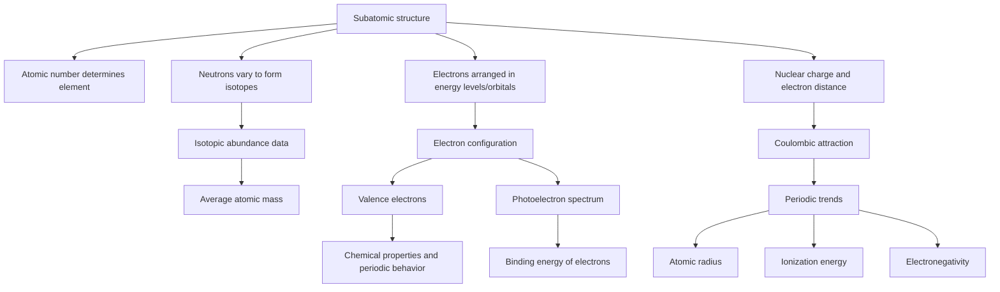

# Unit 1: Atomic Structure and Properties

## Overview
This unit introduces the particle-level structure of atoms and how that structure explains measurable properties such as **mass**, **charge**, **electron arrangement**, and **periodic trends**. On the AP exam, these ideas are foundational because they support later topics like bonding, intermolecular forces, and reactivity—and they are often tested through data interpretation, especially with **mass spectra**, **photoelectron spectra**, and **periodic reasoning**.

## Key Concepts at a Glance

| **Concept** | **What It Is** | **Why It Matters (AP angle)** |
|---|---|---|
| **Mole concept** | The **mole** is a counting unit equal to $$6.022 \times 10^{23}$$ particles. | AP Chemistry frequently asks students to connect **macroscopic amounts** to **particle counts** and **mass**. |
| **Atomic mass and isotopes** | Atoms of the same element can have different numbers of neutrons; these are **isotopes**. | You may need to calculate or interpret **average atomic mass** from isotopic abundance data. |
| **Mass spectrometry** | A technique that separates particles by **mass-to-charge ratio** and shows isotopic peaks. | AP questions often use spectra to identify **isotopes**, estimate **relative abundance**, or infer **average atomic mass**. |
| **Subatomic particles** | **Protons**, **neutrons**, and **electrons** determine identity, mass, and charge. | Essential for distinguishing **atomic number**, **mass number**, ions, and isotopes. |
| **Electron configuration** | The arrangement of electrons in atomic orbitals and energy levels. | AP questions test how configuration explains **chemical behavior**, **valence electrons**, and periodic patterns. |
| **Photoelectron spectroscopy (PES)** | A method that measures the energy needed to remove electrons from atoms. | PES links directly to **electron configuration** and helps compare **electron binding energies**. |
| **Periodic trends** | Predictable patterns in **atomic radius**, **ionization energy**, **electron affinity**, and **electronegativity**. | A major AP skill is explaining trends using **effective nuclear charge** and **distance from nucleus**, not just memorizing directions. |
| **Coulombic attraction** | The attractive force between opposite charges depends on charge and distance. | Used to explain why some electrons are held more tightly and why many periodic trends occur. |

## Core Processes / Relationships

### Big relationship to remember
Many questions in this unit follow this logic:

1. **Atomic structure** determines  
2. **electron arrangement**, which determines  
3. **how strongly electrons are attracted**, which determines  
4. **periodic properties** and chemical behavior.

## Essential Formulas / Laws / Rules

### 1. **Avogadro’s number**
$$1\ \text{mol} = 6.022 \times 10^{23}\ \text{particles}$$

### 2. **Molar mass relationship**
$$\text{moles} = \frac{\text{mass}}{\text{molar mass}}$$

$$\text{mass} = \text{moles} \times \text{molar mass}$$

### 3. **Average atomic mass**
$$\text{average atomic mass} = \sum (\text{isotope mass})(\text{fractional abundance})$$

If percent abundance is given:
$$\text{fractional abundance} = \frac{\text{percent abundance}}{100}$$

### 4. **Mass number**
$$\text{mass number} = \text{protons} + \text{neutrons}$$

### 5. **Charge of an ion**
$$\text{charge} = \text{protons} - \text{electrons}$$

### 6. **Coulomb’s law relationship**
You usually do not need the full constant-based equation, but the proportional relationship matters:
$$F \propto \frac{q_1 q_2}{r^2}$$

This means:
- greater nuclear charge $\rightarrow$ stronger attraction
- greater distance from nucleus $\rightarrow$ weaker attraction

### 7. **Electron configuration rules**
- **Aufbau principle**: electrons fill lower-energy orbitals first.
- **Pauli exclusion principle**: an orbital holds at most **2 electrons** with opposite spins.
- **Hund’s rule**: electrons fill equal-energy orbitals singly before pairing.

### 8. **Photoelectron spectroscopy rule**
In **PES**, a **higher binding energy** means an electron is held **more tightly** by the nucleus.

## Connections & Comparisons

| **Topic** | **Mass Spectrometry** | **Photoelectron Spectroscopy (PES)** |
|---|---|---|
| **What is measured?** | **Mass-to-charge ratio** of particles | **Binding energy** of electrons |
| **Main use** | Identify **isotopes** and their abundances | Infer **electron configuration** and relative electron energies |
| **What do peak heights/areas mean?** | Relative abundance of isotopes | Number of electrons in a given energy level/sublevel |
| **What does peak position mean?** | Relative mass | Energy required to remove electrons |
| **AP skill** | Calculate **average atomic mass** | Match a spectrum to an element or electron arrangement |

### Periodic Trend Comparison

| **Property** | **Across a Period** | **Down a Group** | **Why** |
|---|---|---|---|
| **Atomic radius** | Decreases | Increases | More **effective nuclear charge** across; more energy levels down |
| **Ionization energy** | Increases | Decreases | Electrons are held more tightly across; more shielding and distance down |
| **Electronegativity** | Increases | Decreases | Stronger pull on bonding electrons across; weaker attraction down |
| **Shielding** | Roughly similar across the same period | Increases | More inner electron levels are added down a group |

## Common AP Exam Traps

- Confusing **mass number** with **average atomic mass**.  
  - **Mass number** is for one isotope.  
  - **Average atomic mass** is a weighted average of all naturally occurring isotopes.

- Thinking that the tallest **mass spectrum** peak always means the heaviest isotope.  
  It usually means the **most abundant** isotope, not necessarily the heaviest one.

- Assuming electrons are removed from the same orbital order they are filled.  
  For transition metals later, electrons are often removed from the **highest principal energy level first**, not simply the last-filled sublevel.

- Memorizing periodic trends without explaining them.  
  AP free-response questions usually want reasoning based on **Coulombic attraction**, **shielding**, and **distance from the nucleus**.

- Misreading **PES** peaks.  
  In PES, a peak farther left/right depends on the axis, so focus on the key idea: **higher binding energy = electrons closer to the nucleus or experiencing stronger attraction**.

## Quick Review Checklist

- [ ] I can define **protons**, **neutrons**, **electrons**, **atomic number**, and **mass number**.
- [ ] I can calculate the number of particles from **moles** using $$6.022 \times 10^{23}$$.
- [ ] I can convert between **mass**, **moles**, and **molar mass**.
- [ ] I can determine **average atomic mass** from isotopic masses and abundances.
- [ ] I can interpret a **mass spectrum** to identify isotopes and relative abundance.
- [ ] I can write and interpret **electron configurations** for atoms and ions.
- [ ] I can use **PES data** to infer which electrons are more tightly bound and connect peaks to electron arrangement.
- [ ] I can explain **atomic radius**, **ionization energy**, and **electronegativity** trends using **effective nuclear charge** and **distance**.