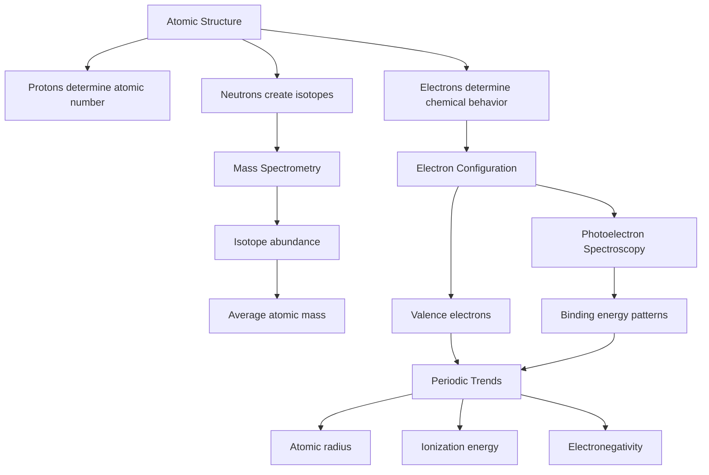

# Unit 1: Atomic Structure and Properties

## Overview

Unit 1 builds the foundation for AP Chemistry by connecting the **subatomic structure of atoms** to measurable properties like **mass**, **electron arrangement**, and **periodic trends**. You will learn how chemists count atoms using the **mole**, interpret **mass spectra** and **photoelectron spectra**, and explain why elements behave differently based on **electron configuration** and **Coulombic attraction**.

---

## Key Concepts at a Glance

| **Concept** | **What It Is** | **Why It Matters (AP angle)** |
|---|---|---|
| **Mole** | A counting unit representing Avogadro’s number of particles | Used constantly in stoichiometry, lab calculations, and particle-to-mass conversions |
| **Molar Mass** | The mass of one mole of a substance | Connects grams, moles, and particles |
| **Mass Spectrometry** | A technique that separates isotopes based on mass-to-charge ratio | Explains **average atomic mass** and isotope abundance |
| **Electron Configuration** | The arrangement of electrons in atomic orbitals | Predicts chemical behavior, ion formation, and periodic trends |
| **Photoelectron Spectroscopy (PES)** | A method that measures electron binding energies | Provides evidence for shells, subshells, and effective nuclear charge |
| **Coulombic Attraction** | Attraction between oppositely charged particles | Explains ionization energy, atomic radius, and electron binding energy |
| **Periodic Trends** | Patterns in atomic properties across the periodic table | Frequently tested through explanation, prediction, and comparison questions |
| **Valence Electrons** | Electrons in the outermost energy level | Determine bonding, reactivity, and element classification |

---

## Core Processes / Relationships

A major theme of this unit is that **atomic-level structure explains macroscopic properties**. The number of **protons** defines the element, the number of **neutrons** explains isotopes, and the number and arrangement of **electrons** determine chemical properties.

---

## Essential Formulas / Laws / Rules

### 1. Avogadro’s Number

One mole contains Avogadro’s number of particles:

$$
1 \text{ mol} = 6.022 \times 10^{23} \text{ particles}
$$

This applies to atoms, molecules, ions, or formula units.

---

### 2. Mole-Mass-Particle Relationships

To convert between mass and moles:

$$
\text{moles} = \frac{\text{mass in grams}}{\text{molar mass}}
$$

$$
\text{mass in grams} = \text{moles} \times \text{molar mass}
$$

To convert between moles and particles:

$$
\text{particles} = \text{moles} \times 6.022 \times 10^{23}
$$

$$
\text{moles} = \frac{\text{particles}}{6.022 \times 10^{23}}
$$

---

### 3. Average Atomic Mass

The atomic mass on the periodic table is a **weighted average** of naturally occurring isotopes:

$$
\text{average atomic mass} = \sum \left(\text{isotope mass} \times \text{fractional abundance}\right)
$$

Percent abundance must be converted to a decimal before use:

$$
25.0\% = 0.250
$$

---

### 4. Coulomb’s Law

The force of attraction between charged particles is described by Coulomb’s law:

$$
F \propto \frac{q_1q_2}{r^2}
$$

Where:

$$
q_1 \text{ and } q_2 = \text{charges}
$$

$$
r = \text{distance between charges}
$$

For atoms, this means electrons are held more tightly when the **nucleus has more protons** or when the electron is **closer to the nucleus**.

---

### 5. Electron Configuration Rules

Electrons fill orbitals according to the **Aufbau principle**, **Pauli exclusion principle**, and **Hund’s rule**.

**Aufbau principle:** Electrons fill lower-energy orbitals before higher-energy orbitals.

Common filling order:

$$
1s \rightarrow 2s \rightarrow 2p \rightarrow 3s \rightarrow 3p \rightarrow 4s \rightarrow 3d \rightarrow 4p
$$

**Pauli exclusion principle:** Each orbital can hold a maximum of two electrons with opposite spins.

$$
\text{maximum electrons per orbital} = 2
$$

**Hund’s rule:** Electrons occupy equal-energy orbitals singly before pairing.

---

### 6. Shell and Subshell Capacities

| Subshell | Number of Orbitals | Maximum Electrons |
|---|---:|---:|
| $$s$$ | $$1$$ | $$2$$ |
| $$p$$ | $$3$$ | $$6$$ |
| $$d$$ | $$5$$ | $$10$$ |
| $$f$$ | $$7$$ | $$14$$ |

---

### 7. Ion Formation and Electron Configuration

Cations lose electrons from the **highest principal energy level** first.

Example:

$$
\text{Fe}: [\text{Ar}]4s^23d^6
$$

$$
\text{Fe}^{2+}: [\text{Ar}]3d^6
$$

The $$4s$$ electrons are removed before $$3d$$ electrons when transition metals form ions.

---

## Connections & Comparisons

| Topic | Mass Spectrometry | Photoelectron Spectroscopy |
|---|---|---|
| **What it studies** | Isotopes of an element | Electrons in atoms |
| **Key measurement** | Mass-to-charge ratio | Electron binding energy |
| **Graph shows** | Relative isotope abundance | Peaks for electron groups |
| **AP interpretation** | Calculate average atomic mass | Identify shells/subshells and compare effective nuclear charge |
| **Important idea** | Isotopes differ in neutron number | Electrons closer to nucleus have higher binding energy |

---

### Periodic Trend Comparison

| Trend | Across a Period, Left to Right | Down a Group | Main Reason |
|---|---|---|---|
| **Atomic Radius** | Decreases | Increases | More protons pull electrons closer across a period; more energy levels are added down a group |
| **Ionization Energy** | Increases | Decreases | Electrons are harder to remove when held more tightly by the nucleus |
| **Electronegativity** | Increases | Decreases | Smaller atoms with stronger nuclear attraction pull bonding electrons more strongly |
| **Electron Binding Energy** | Generally increases | Generally decreases for valence electrons | Stronger attraction means electrons require more energy to remove |

---

### Atomic Radius vs. Ionization Energy

These trends are often tested together. If an atom has a **smaller radius**, its valence electrons are usually held more tightly, so its **ionization energy** is usually higher.

---

## Common AP Exam Traps

- **Confusing mass number with atomic mass.** Mass number is the total number of protons and neutrons in one isotope, while atomic mass is a weighted average of isotopes.

- **Forgetting to convert percent abundance to decimal form.** Use $$0.735$$, not $$73.5$$, when calculating weighted average atomic mass.

- **Removing transition metal electrons from the wrong subshell.** For ions, electrons are removed from the highest principal energy level first, so $$4s$$ electrons are removed before $$3d$$ electrons.

- **Assuming all periodic trends are absolute.** There are exceptions, especially in ionization energy, due to electron pairing and subshell stability.

- **Misreading PES peaks.** A higher binding energy means the electron is held more tightly and is usually closer to the nucleus.

---

## Quick Review Checklist

- [ ] Convert between **grams**, **moles**, and **particles** using molar mass and Avogadro’s number.

- [ ] Calculate **average atomic mass** from isotope masses and relative abundances.

- [ ] Interpret a **mass spectrum** to identify isotopes and determine relative abundance.

- [ ] Write full and noble-gas **electron configurations** for atoms and common ions.

- [ ] Apply **Aufbau principle**, **Pauli exclusion principle**, and **Hund’s rule** correctly.

- [ ] Interpret **photoelectron spectroscopy** data in terms of shells, subshells, and binding energy.

- [ ] Explain **periodic trends** using Coulombic attraction and effective nuclear charge.

- [ ] Compare atomic radius, ionization energy, and electronegativity across periods and down groups.